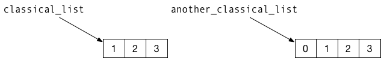
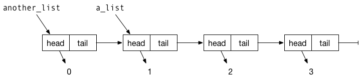

```{r setup, include = FALSE}
knitr::opts_chunk$set(
  collapse = TRUE,
  comment = "#>"
)
library(pmatch)
```

The `pmatch` package allows you to define and match against patterns using a syntax similar to [Haskell](https://en.wikipedia.org/wiki/Haskell_(programming_language)) and [Standard ML](https://en.wikipedia.org/wiki/Standard_ML). In those two programming languages, you define new data types by specifying function-like constructors for creating values of those types, and you can then match actual values against constructors when you write functions, such that you can easily dispatch particular values to particular cases when defining functions.

## A simple example: A linked list.

R has the `list` data type for handling sequences of values of any type, but despite its name it is not the kind of lists you see in most functional programming languages. In pure function programming languages you cannot modify data so whenever you want to update a data structure you have to construct a completely new one. (in R you have to jump through some loops to do so, but the language lets you fake it to some degree). The only way you can modify the kind of lists that `list` represent is to make a new copy of the entire object. With linked lists, however, lists are represented in a pointer-like structure so you can modify the beginning of lists and share the tail of lists between different instances.

That is a lot of abstract discussion of lists. To make it concrete, consider a `list` such as this:

```{r}
classical_list <- list(1, 2, 3)
```

This is a `list` with three values, 1, 2, and 3, and these are represented as a contiguous chunk of computer memory. If we construct a new list by prepending a value

```{r}
another_classical_list <- c(0, classical_list)
```

R will have to create a new list with four elements that are placed in contiguous memory. This can be visualised as the figure below, where the `list` objects are shown as boxes and the mapping from variables to values are shown as arrows.



Because of the way R represent `list` objects, we need to make a copy of `classical_list` to create `another_classical_list`; after all, the elements have to be in contiguous memory.

Consider as an alternative this *linked list*:

```{r}
cons <- function(head, tail) {
    list(head = head, tail = tail)
}

a_list <- cons(1, cons(2, cons(3, NULL)))
a_list
```

By constructing objects with a head and a tail, we can let different variables refer to different `list` objects that share part of their tail. For example, with this `another_list`, 

```{r}
another_list <- cons(0, a_list)
```

we have one `list` object only used in `another_list` and three that are shared between `a_list` and `another_list`. In the figure below, I have illustrated how these lists are represented in memory. Again, the rectangles represent the `list` objects the data structures are constructed from and the arrows represent which data objects which variables refer to, where "variables"" now refer both to named `list` components and the two variables `a_list` and `another_list`.



We cannot modify a `list` object without creating a new copy of them, but we do not need to when we create `another_list`. We just need to create the first `list` element; its `tail` can simply point to the same object that `a_list` points to.

To work with this kind of lists, we need to be able to unpack the components of each `list` object they are constructed form. For example, to compute the length of a list, we can do something like this:

```{r}
list_length <- function(the_list) {
    n <- 0
    while (!is.null(the_list)) {
        n <- n + 1
        the_list <- the_list$tail
    }
    n
}

list_length(a_list)
list_length(another_list)
```


This is an imperative (or looping) implementation. In functional programming, a recursive version might be more natural

```{r}
rec_list_length <- function(the_list) {
    if (is.null(the_list)) 0
    else 1 + list_length(the_list$tail)
}
rec_list_length(a_list)
rec_list_length(another_list)
```

In a case as simple as this, there is no particular benefit to the recursive function, but in many cases recursion leads to simpler implementations.

What we have done so far in this example is this: we have defined a data structure with a constructor, `cons` that creates new elements from simpler instances of the same type, with `NULL` used as the simplest form of the type. To work with elements of the type we test whether we have our hands on the basic element, using `is.null`, or a more complex one.

With the `pmatch` you can be more explicit in how you define types *and* in how you match which kind of instances you have.

To define a linked list type we want to specify what the basic instances look like—we are more explicit about it than just using `NULL`—and what composite instances look like. We can define a linked list type like this:

```{r}
linked_list := NIL | CONS(car, cdr : linked_list)
```

Here, I have used `car` for the head of a list and `cdr` for the tail. These are traditional names inherited from the [lisp programming language that in turn inherited them from IBM 704](https://en.wikipedia.org/wiki/CAR_and_CDR). I have chosen these names so we do not class with the R functions `head` and `tail`. This expression defines the type `linked_list`, specify that we can create objects of the type using one of the two constructores `NIL` or `CONS()`, where the former takes no arguments and the second two, of which the second argument must be another linked list.

We can create `a_list` using these constructors like this:

```{r}
a_list <- CONS(1, CONS(2, CONS(3, NIL)))
a_list
```

We can't use `is.null` to check if a list is `NIL`, but instead we can use the function `cases`. It will match a value against a pattern, find the first pattern that matches, and evaluate the expression it is associated with. For list lengths, we can implement a version that works with this definition of the type like this:

```{r}
list_length <- function(the_list)
    cases(the_list,
          NIL -> 0,
          CONS(car, cdr) -> 1 + list_length(cdr))

list_length(a_list)
```

When we pattern-match like this, we also bind variables. In the `CONS(car, cdr)` pattern we didn't have to name the variables `car` and `cdr` just because we called them in the constructor. In the pattern matching they are just variables and they get set to the corresponding values in the structor of `the_list`. This is why we can use `cdr` in the expression we evaluate when we match the pattern—`cdr` will be bound to the tail of the list.

We can also see this in another example where we sum all the elements in a list:

```{r}
list_sum <- function(the_list)
    cases(the_list,
          NIL -> 0,
          CONS(car, cdr) -> car + list_sum(cdr))

list_sum(a_list)
```

Here, both `car` and `cdr` gets bound to components of `the_list`.

## Rules for defining functions and matching patterns

Creating types with `pmatch` follows these rules:

 1. You define a new type using `:=` and name the type to the left-hand side of the operator and specify constructors on the right-hand side.
 2. Constructors are provided as one or more `|`-separated constructor-specifications. 
 3. A constructor-specification can be a constant or be constructed from other values,
	  a. If it is a constant, you should specify a name, and
	  b. if it constructs values from other elements you should provide its arguments as a comma-separated list after the constructor name.
 4. You can specify the type of a constructor argument by adding the type name after `:` after the argument name.

It might look a bit complicated, but the rules simply mean that you write expressions like these

```{r}
colours := RED | GREEN | BLUE
counts := ZERO | ONE | MANY
```

to define constants or 

```{r}
linked_list := NIL | CONS(car, cdr : linked_list)
tree := Leaf | Tree(left : tree, val, right : tree)
```

for recursive data structures. 

When you match on patterns you can match on constants or more complicated constructions. Variables in a pattern will be bound and can be used in the expression that a pattern match function will evaluate.

```{r}
f <- function(tree) {
    cases(tree,
          Leaf -> "leaf",
          Tree(left, 0, right) -> "zero",
          Tree(left, v, right) -> v)
}
f(Leaf)
f(Tree(Leaf,0,Leaf))
f(Tree(Tree(Leaf,0,Leaf), 42, Tree(Leaf, 1, Leaf)))
f(Tree(Tree(Leaf,0,Leaf), 1984, Tree(Leaf, 1, Leaf)))
```

All variables that appear in a pattern and do not refer to a constructor will be assigned a value if the pattern matches. If you want to match against a value you have in a variable you can use quasi-quotation using the "bang-bang" operator, `!!`:

```{r}
important <- 42
f <- function(tree) {
    cases(tree,
          Leaf -> "leaf",
          Tree(left, 0, right) -> "zero",
          Tree(left, !!important, right) -> "The meaning of life!",
          Tree(left, v, right) -> v)
}
f(Leaf)
f(Tree(Leaf,0,Leaf))
f(Tree(Tree(Leaf,0,Leaf), 42, Tree(Leaf, 1, Leaf)))
f(Tree(Tree(Leaf,0,Leaf), 1984, Tree(Leaf, 1, Leaf)))
```

